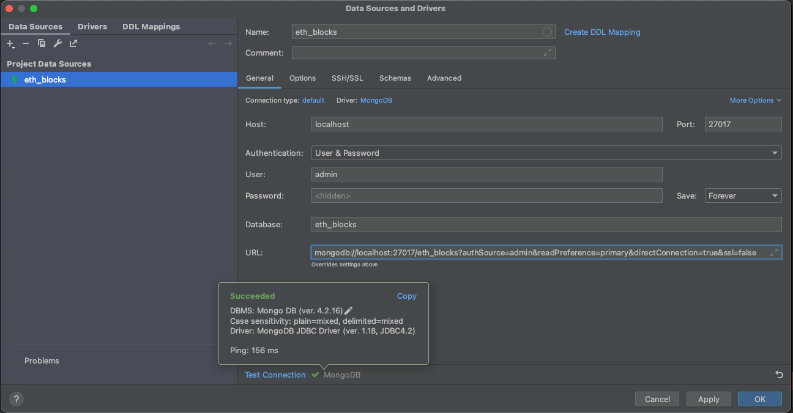

# The API Builder

The builder provides capabilities to run the multi-service application. It consists of API, Emitter, and Listener
services and uses Redis, MongoDB, and RabbitMQ.

### Prerequisites

- Docker and Docker Compose installed
- Make sure the required ports are available on the system

### Installation

1. Clone the repository to the local machine
2. Navigate to the project directory
3. Run the application using the Makefile commands

## Usage

### Makefile Commands

- **clean**: Remove the .tmp directory
   ```bash
   make clean

- **build**: Build the Docker images without using cache
   ```bash
   make build

- **run**: Build and run the Docker containers
   ```bash
   make run

- **stop**: Stop the running Docker containers
   ```bash
   make stop

The project uses the [Air](https://github.com/cosmtrek/air) package for live reloading. It watches for file changes and
automatically restarts the application. The Air configuration is stored in the .air.toml file.

## MongoDB



#### Example of MongoDB URL

   ```bash
mongodb://localhost:27017/eth_blocks?authSource=admin&readPreference=primary&directConnection=true&ssl=false

```

## MongoDB Replication

#### Examples of MongoDB Containers for read-replicas:

   ```bash
eth-blocks-mongo-replica:
  image: 'mongo:4.2.16-bionic'
  ports:
    - "27018:27017"
  environment:
    MONGO_INITDB_DATABASE: eth_blocks
    MONGO_INITDB_ROOT_USERNAME: admin
    MONGO_INITDB_ROOT_PASSWORD: password123
  volumes:
    - ./.db-data/mongodb-replica/:/data/db
    - ./mongodb-keyfile:/opt/keyfile/mongodb-keyfile
  command: --replSet mongoReplicaSet2 --keyFile /opt/keyfile/mongodb-keyfile
  healthcheck:
    test: [ "CMD", "mongo", "-u", "admin", "-p", "password123", "--authenticationDatabase", "admin", "--eval", "db.adminCommand('ping')" ]
    interval: 10s
    timeout: 10s
    retries: 3

eth-transactions-mongo-replica:
  image: 'mongo:4.2.16-bionic'
  ports:
    - "27018:27017"
  environment:
    MONGO_INITDB_DATABASE: eth_blocks
    MONGO_INITDB_ROOT_USERNAME: admin
    MONGO_INITDB_ROOT_PASSWORD: password123
  volumes:
    - ./.db-data/mongodb-replica/:/data/db
    - ./mongodb-keyfile:/opt/keyfile/mongodb-keyfile
  command: --replSet mongoReplicaSet2 --keyFile /opt/keyfile/mongodb-keyfile
  healthcheck:
    test: [ "CMD", "mongo", "-u", "admin", "-p", "password123", "--authenticationDatabase", "admin", "--eval", "db.adminCommand('ping')" ]
    interval: 10s
    timeout: 10s
    retries: 3
```


#### Examples of MongoDB containers for  write-replicas:

   ```bash
eth-blocks-mongo:
  build:
    context: ./
    dockerfile: ./eth-blocks-mongo-replica-init/eth-blocks-mongo.dockerfile
  ports:
    - "27017:27017"
  environment:
    MONGO_INITDB_DATABASE: eth_blocks
    MONGO_INITDB_ROOT_USERNAME: admin
    MONGO_INITDB_ROOT_PASSWORD: password123
  volumes:
    - ./.db-data/eth-blocks-mongo/:/data/db
    - ./eth-blocks-mongo-replica-init/mongodb-keyfile:/opt/keyfile/mongodb-keyfile
  depends_on:
    eth-blocks-mongo-replica:
      condition: service_healthy
  command: --replSet ethBlocksMongoReplica --keyFile /opt/keyfile/mongodb-keyfile


eth-transactions-mongo:
  build:
    context: ./
    dockerfile: ./eth-transactions-mongo-replica-init/eth-transactions-mongo.dockerfile
  ports:
    - "27017:27017"
  environment:
    MONGO_INITDB_DATABASE: eth_blocks
    MONGO_INITDB_ROOT_USERNAME: admin
    MONGO_INITDB_ROOT_PASSWORD: password123
  volumes:
    - ./.db-data/eth-transactions-mongo/:/data/db
    - ./eth-transactions-mongo-replica-init/mongodb-keyfile:/opt/keyfile/mongodb-keyfile
  depends_on:
    eth-transactions-mongo-replica:
      condition: service_healthy
  command: --replSet ethTransactionsMongoReplica --keyFile /opt/keyfile/mongodb-keyfile
```


#### Example of the bash rerun-script for the Makefile:

```bash
rerun:
  @make purge
  @make build
  @docker-compose up  -d
  @echo "Rerunning, please wait..."
  @for i in {1..30}; do \
		for c in / - \\ \|; do \
			printf "\r%c" "$$c"; \
			sleep 0.25; \
		done; \
  done; printf "\n"
  @docker exec -it eth-builder-mongo-1 mongo -u admin -p password123 --authenticationDatabase admin /docker-entrypoint-initdb.d/replica.js
  @echo "Done rerunning!"
```

